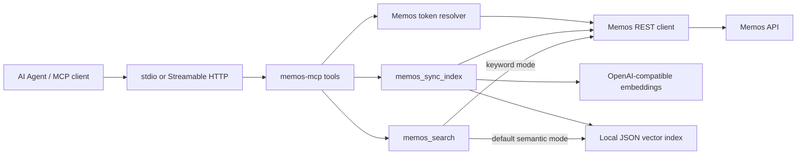

# memos-mcp

**English** | [简体中文](./README.zh-CN.md)

[](https://github.com/CharyeahOwO/memos-mcp/actions/workflows/ci.yml)
[](https://github.com/CharyeahOwO/memos-mcp/actions/workflows/docker-image.yml)

Turn Memos into a searchable long-term memory layer for AI agents.

memos-mcp is a lightweight semantic retrieval layer for [Memos](https://github.com/usememos/memos). It syncs memo content into a local vector index, provides keyword search and semantic search, and exposes the results through MCP tools.

## Features

| Capability | Description |
| --- | --- |
| Local vector index | Stores memo embeddings in a local JSON index at `MEMOS_MCP_INDEX_DB`. |
| Semantic search | `memos_search` defaults to semantic retrieval over the local index. |
| Keyword search | `memos_search` with `mode: "keyword"` uses Memos keyword filtering. |
| Time search | Query by day, date range, or same month/day across years. |
| Tags and resources | Aggregate tags and resources from memo pages. |
| Safe writes | `memos_create` requires explicit visibility: `PRIVATE`, `PROTECTED`, or `PUBLIC`. |
| Update controls | `memos_update` and `memos_archive` are hidden unless explicitly enabled. |
| MCP transports | Supports stdio and Streamable HTTP. |

Supported clients include Claude Desktop, Cursor, VS Code Copilot MCP, Codex CLI, Hermes Agent, OpenClaw, and any MCP client that supports stdio or Streamable HTTP.

## Requirements

| Requirement | Notes |
| --- | --- |
| Node.js | 20 or newer |
| Memos | v0.24+ recommended |
| Memos PAT | Used by stdio as `MEMOS_ACCESS_TOKEN` or by HTTP as `Authorization: Bearer <Memos token>` |
| Embedding API | OpenAI-compatible `/v1/embeddings` endpoint |

The embedding endpoint is required. `memos_search` is semantic by default. The server keeps the local index fresh with TTL-based sync, and `memos_sync_index` remains available for manual refresh or rebuild.

## Architecture



The runtime has one retrieval model: a local MCP server plus a local vector index. stdio and HTTP are transport choices for connecting MCP clients to the same service.

## Deploy

### 1. Install

```bash
git clone https://github.com/CharyeahOwO/memos-mcp.git
cd memos-mcp
npm install
cp .env.example .env
npm run build
```

### 2. Configure

Minimum `.env`:

```env
MEMOS_BASE_URL=https://memos.example.com
MEMOS_ACCESS_TOKEN=memos_pat_xxxx
MEMOS_MCP_TRANSPORT=stdio

MEMOS_MCP_INDEX_DB=./data/memos-mcp-index.json
MEMOS_MCP_EMBEDDING_PROVIDER=openai-compatible
MEMOS_MCP_EMBEDDING_BASE_URL=https://api.example.com/v1
MEMOS_MCP_EMBEDDING_MODEL=BAAI/bge-m3
MEMOS_MCP_EMBEDDING_API_KEY=sk_xxxx
MEMOS_MCP_EMBEDDING_BATCH_SIZE=32
MEMOS_MCP_INDEX_TTL_MINUTES=120
MEMOS_MCP_EXPIRED_INDEX_BEHAVIOR=sync
MEMOS_MCP_SYNC_INTERVAL_MINUTES=120
MEMOS_MCP_SYNC_ON_START=true
```

Use an embedding base URL that accepts OpenAI-compatible embedding requests at `/v1/embeddings`. For example, if `MEMOS_MCP_EMBEDDING_BASE_URL=https://api.example.com/v1`, memos-mcp calls `https://api.example.com/v1/embeddings`.

### 3. Run

Use stdio when the MCP client starts the server process:

```bash
node --env-file=.env dist/index.js
```

Use Streamable HTTP when the MCP client connects to a local endpoint:

```bash
MEMOS_MCP_TRANSPORT=http \
MEMOS_MCP_HOST=127.0.0.1 \
MEMOS_MCP_PORT=8080 \
node --env-file=.env dist/index.js
```

HTTP endpoint:

```text
http://127.0.0.1:8080/mcp
```

HTTP clients must send:

```http
Authorization: Bearer <Memos token>
```

### 4. Maintain The Index

The server treats the local vector index as a cache with a TTL. By default:

- `memos_search` checks the index before semantic search.
- If the index is missing or expired, the server runs an incremental sync first.
- A long-running server also syncs in the background every 120 minutes when `MEMOS_ACCESS_TOKEN` is configured.

Manual maintenance tools remain available:

```text
memos_sync_index
memos_index_status
memos_search {"query":"your query"}
```

Keyword search is still available:

```json
{
  "query": "project note",
  "mode": "keyword"
}
```

## Docker Compose

```yaml
services:
  memos-mcp:
    image: ghcr.io/charyeahowo/memos-mcp:main
    restart: unless-stopped
    environment:
      MEMOS_BASE_URL: http://host.docker.internal:5230
      MEMOS_ACCESS_TOKEN: memos_pat_xxxx
      MEMOS_MCP_TRANSPORT: http
      MEMOS_MCP_HOST: 0.0.0.0
      MEMOS_MCP_PORT: 8080
      MEMOS_MCP_READONLY: "false"
      MEMOS_MCP_ENABLE_UPDATE_TOOLS: "false"
      MEMOS_MCP_INDEX_DB: /data/memos-mcp-index.json
      MEMOS_MCP_EMBEDDING_PROVIDER: openai-compatible
      MEMOS_MCP_EMBEDDING_BASE_URL: https://api.example.com/v1
      MEMOS_MCP_EMBEDDING_MODEL: BAAI/bge-m3
      MEMOS_MCP_EMBEDDING_API_KEY: sk_xxxx
      MEMOS_MCP_EMBEDDING_BATCH_SIZE: "32"
      MEMOS_MCP_INDEX_TTL_MINUTES: "120"
      MEMOS_MCP_EXPIRED_INDEX_BEHAVIOR: sync
      MEMOS_MCP_SYNC_INTERVAL_MINUTES: "120"
      MEMOS_MCP_SYNC_ON_START: "true"
    ports:
      - "127.0.0.1:8080:8080"
    volumes:
      - memos-mcp-data:/data
    extra_hosts:
      - "host.docker.internal:host-gateway"

volumes:
  memos-mcp-data:
```

The image creates `/data` as UID/GID `10001:10001`, so a new named volume can be written by the non-root process. If you already created a root-owned volume with an older image, recreate the volume or fix its ownership before running `memos_sync_index`.

If you use a bind mount for `/data`, make the host directory writable by UID/GID `10001:10001`:

```bash
mkdir -p /tmp/memos-mcp-data
sudo chown -R 10001:10001 /tmp/memos-mcp-data
```

Bind mount shape:

```yaml
volumes:
  - /tmp/memos-mcp-data:/data
```

## systemd

Create `/etc/memos-mcp/memos-mcp.env`:

```env
MEMOS_BASE_URL=http://127.0.0.1:5230
MEMOS_MCP_TRANSPORT=http
MEMOS_MCP_HOST=127.0.0.1
MEMOS_MCP_PORT=8080
MEMOS_MCP_INDEX_DB=/var/lib/memos-mcp/memos-mcp-index.json
MEMOS_MCP_EMBEDDING_PROVIDER=openai-compatible
MEMOS_MCP_EMBEDDING_BASE_URL=https://api.example.com/v1
MEMOS_MCP_EMBEDDING_MODEL=BAAI/bge-m3
MEMOS_MCP_EMBEDDING_API_KEY=sk_xxxx
```

Create `/etc/systemd/system/memos-mcp.service`:

```ini
[Unit]
Description=memos-mcp
After=network-online.target

[Service]
Type=simple
WorkingDirectory=/opt/memos-mcp
EnvironmentFile=/etc/memos-mcp/memos-mcp.env
ExecStart=/usr/bin/node /opt/memos-mcp/dist/index.js
Restart=on-failure
RestartSec=5

[Install]
WantedBy=multi-user.target
```

Start:

```bash
sudo systemctl daemon-reload
sudo systemctl enable --now memos-mcp
journalctl -u memos-mcp -f
```

## pm2

```js
module.exports = {
  apps: [
    {
      name: "memos-mcp",
      script: "dist/index.js",
      env: {
        MEMOS_BASE_URL: "http://127.0.0.1:5230",
        MEMOS_MCP_TRANSPORT: "http",
        MEMOS_MCP_HOST: "127.0.0.1",
        MEMOS_MCP_PORT: "8080",
        MEMOS_MCP_INDEX_DB: "./data/memos-mcp-index.json",
        MEMOS_MCP_EMBEDDING_PROVIDER: "openai-compatible",
        MEMOS_MCP_EMBEDDING_BASE_URL: "https://api.example.com/v1",
        MEMOS_MCP_EMBEDDING_MODEL: "BAAI/bge-m3",
        MEMOS_MCP_EMBEDDING_API_KEY: "sk_xxxx"
      }
    }
  ]
};
```

```bash
pm2 start ecosystem.config.cjs
pm2 save
```

## Client Configuration

### Claude Desktop / Cursor

```json
{
  "mcpServers": {
    "memos": {
      "command": "node",
      "args": ["/absolute/path/to/memos-mcp/dist/index.js"],
      "env": {
        "MEMOS_BASE_URL": "https://memos.example.com",
        "MEMOS_ACCESS_TOKEN": "memos_pat_xxxx",
        "MEMOS_MCP_INDEX_DB": "./data/memos-mcp-index.json",
        "MEMOS_MCP_EMBEDDING_PROVIDER": "openai-compatible",
        "MEMOS_MCP_EMBEDDING_BASE_URL": "https://api.example.com/v1",
        "MEMOS_MCP_EMBEDDING_MODEL": "BAAI/bge-m3",
        "MEMOS_MCP_EMBEDDING_API_KEY": "sk_xxxx"
      }
    }
  }
}
```

### VS Code Copilot MCP

```json
{
  "servers": {
    "memos": {
      "type": "stdio",
      "command": "node",
      "args": ["/absolute/path/to/memos-mcp/dist/index.js"],
      "env": {
        "MEMOS_BASE_URL": "https://memos.example.com",
        "MEMOS_ACCESS_TOKEN": "memos_pat_xxxx",
        "MEMOS_MCP_INDEX_DB": "./data/memos-mcp-index.json",
        "MEMOS_MCP_EMBEDDING_PROVIDER": "openai-compatible",
        "MEMOS_MCP_EMBEDDING_BASE_URL": "https://api.example.com/v1",
        "MEMOS_MCP_EMBEDDING_MODEL": "BAAI/bge-m3",
        "MEMOS_MCP_EMBEDDING_API_KEY": "sk_xxxx"
      }
    }
  }
}
```

### Codex CLI

```toml
[mcp_servers.memos]
command = "node"
args = ["/absolute/path/to/memos-mcp/dist/index.js"]

[mcp_servers.memos.env]
MEMOS_BASE_URL = "https://memos.example.com"
MEMOS_ACCESS_TOKEN = "memos_pat_xxxx"
MEMOS_MCP_INDEX_DB = "./data/memos-mcp-index.json"
MEMOS_MCP_EMBEDDING_PROVIDER = "openai-compatible"
MEMOS_MCP_EMBEDDING_BASE_URL = "https://api.example.com/v1"
MEMOS_MCP_EMBEDDING_MODEL = "BAAI/bge-m3"
MEMOS_MCP_EMBEDDING_API_KEY = "sk_xxxx"
```

### Generic Streamable HTTP

```json
{
  "mcpServers": {
    "memos": {
      "type": "streamable-http",
      "url": "http://127.0.0.1:8080/mcp",
      "headers": {
        "Authorization": "Bearer memos_pat_xxxx"
      }
    }
  }
}
```

### Hermes Agent

```yaml
mcp_servers:
  memos:
    url: "http://127.0.0.1:8080/mcp"
    headers:
      Authorization: "Bearer memos_pat_xxxx"
    connect_timeout: 10
    timeout: 60
    enabled: true
```

### OpenClaw

```yaml
mcp:
  servers:
    memos:
      url: "http://127.0.0.1:8080/mcp"
      transport: "streamable-http"
      connectionTimeoutMs: 10000
      headers:
        Authorization: "Bearer memos_pat_xxxx"
```

CLI shape:

```bash
openclaw mcp set memos '{"url":"http://127.0.0.1:8080/mcp","transport":"streamable-http","headers":{"Authorization":"Bearer memos_pat_xxxx"}}'
```

## Tools

| Tool | Type | Description |
| --- | --- | --- |
| `memos_list` | read | List recent memos. |
| `memos_get` | read | Get one memo by id or `memos/{id}`. |
| `memos_search` | read | Semantic search by default, keyword search with `mode: "keyword"`. |
| `memos_get_day` | read | Query memos for one calendar day. |
| `memos_get_range` | read | Query memos for a date range. |
| `memos_on_this_day` | read | Query historical memos on the same month/day. |
| `memos_get_by_tag` | read | Query memos by tag. |
| `tags_list` | read | Aggregate tags from memo pages. |
| `resources_list` | read | Aggregate resources from memo pages. |
| `memos_create` | write | Create a memo with explicit visibility. |
| `memos_update` | write | Enable with `MEMOS_MCP_ENABLE_UPDATE_TOOLS=true`. |
| `memos_archive` | write | Enable with `MEMOS_MCP_ENABLE_UPDATE_TOOLS=true`. |
| `memos_sync_index` | read | Sync memo content into the local vector index. |
| `memos_index_status` | read | Inspect index readiness, count, dimensions, model, and path. |

## Configuration

| Variable | Default | Required | Description |
| --- | --- | --- | --- |
| `MEMOS_BASE_URL` | none | yes | Memos instance URL. |
| `MEMOS_ACCESS_TOKEN` | none | stdio / scheduled sync | Memos PAT for stdio mode and server-side startup/interval sync. HTTP clients can still provide a token per request. |
| `MEMOS_MCP_TRANSPORT` | `stdio` | no | `stdio` or `http`. |
| `MEMOS_MCP_HOST` | `127.0.0.1` | no | HTTP bind host. |
| `MEMOS_MCP_PORT` | `8080` | no | HTTP port. |
| `MEMOS_MCP_READONLY` | `false` | no | Hide all write tools. |
| `MEMOS_MCP_ENABLE_UPDATE_TOOLS` | `false` | no | Register `memos_update` and `memos_archive`. |
| `MEMOS_MCP_TIMEZONE` | `UTC` | no | IANA timezone for date tools. |
| `MEMOS_MCP_INDEX_DB` | `./data/memos-mcp-index.json` | no | Local JSON vector index path. |
| `MEMOS_MCP_EMBEDDING_PROVIDER` | `openai-compatible` | no | Embedding provider. |
| `MEMOS_MCP_EMBEDDING_BASE_URL` | none | yes | OpenAI-compatible base URL, usually ending in `/v1`. |
| `MEMOS_MCP_EMBEDDING_MODEL` | none | yes | Embedding model. |
| `MEMOS_MCP_EMBEDDING_API_KEY` | none | no | Embedding API key. |
| `MEMOS_MCP_EMBEDDING_BATCH_SIZE` | `32` | no | Embedding batch size, 1 to 128. |
| `MEMOS_MCP_INDEX_TTL_MINUTES` | `120` | no | Local vector index TTL. `0` disables expiration. |
| `MEMOS_MCP_EXPIRED_INDEX_BEHAVIOR` | `sync` | no | What `memos_search` does when the index is expired: `sync`, `error`, or `allow`. |
| `MEMOS_MCP_SYNC_INTERVAL_MINUTES` | `120` | no | Background sync interval. `0` disables scheduled sync. Requires `MEMOS_ACCESS_TOKEN`. |
| `MEMOS_MCP_SYNC_ON_START` | `true` | no | Run one background sync after server start. Requires `MEMOS_ACCESS_TOKEN`. |

## Troubleshooting

| Symptom | Check |
| --- | --- |
| Startup fails with embedding config errors | Set `MEMOS_MCP_EMBEDDING_BASE_URL` and `MEMOS_MCP_EMBEDDING_MODEL`. |
| HTTP client gets auth errors | Send `Authorization: Bearer <Memos token>` with each MCP request. |
| `memos_search` says the index is empty | Check embedding config and auth; default behavior is to sync automatically before search. |
| Semantic search returns stale results | Check `MEMOS_MCP_INDEX_TTL_MINUTES` and `MEMOS_MCP_EXPIRED_INDEX_BEHAVIOR`, or run `memos_sync_index`. |
| Docker index sync gets `EACCES` | Use the named volume or make the bind mount writable by UID/GID `10001:10001`. |
| Date tools return unexpected days | Set `MEMOS_MCP_TIMEZONE`, for example `Asia/Shanghai`. |

## Development

```bash
npm install
npm run typecheck
npm test
npm run build
npm run validate:repo
npm run smoke:http
```

Real Memos API smoke:

```bash
MEMOS_BASE_URL=https://memos.example.com \
MEMOS_ACCESS_TOKEN=memos_pat_xxxx \
npm run smoke:memos
```

## More Docs

- [Architecture](./docs/architecture.md)
- [Deployment](./docs/deployment.md)
- [Development](./docs/development.md)
- [Semantic Search](./docs/semantic-search.md)

## License

[MIT](./LICENSE) © CharyeahOwO

### Friends & Links

<a href="https://linux.do" target="_blank">
  
</a>
