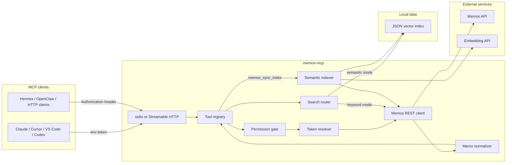

# memos-mcp

**English** | [简体中文](./README.zh-CN.md)

[](https://github.com/CharyeahOwO/memos-mcp/actions/workflows/ci.yml)
[](https://github.com/CharyeahOwO/memos-mcp/actions/workflows/docker-image.yml)

MCP server for [Memos](https://github.com/usememos/memos). It lets AI clients read, search, and write to a Memos instance through the Model Context Protocol.

Use it when you want an AI agent to:

- Search your memos by keyword, date, tag, or semantic similarity.
- Retrieve recent notes or a specific memo by id.
- Create a new memo with explicit `PRIVATE`, `PROTECTED`, or `PUBLIC` visibility.
- Optionally update or archive memos when write tools are enabled.

## Scope

| Area | Status |
| --- | --- |
| List, get, keyword search | supported |
| Date range, day lookup, on-this-day lookup | supported |
| Tag and resource aggregation | supported |
| Create memo | supported, requires explicit visibility |
| Update and archive memo | supported, opt-in |
| Semantic search | supported, opt-in local vector index |
| Delete memo | not implemented |
| Memos admin/user management | not implemented |
| Resource upload | not implemented |

## Requirements

| Requirement | Version / note |
| --- | --- |
| Node.js | 20 or newer |
| Memos | v0.24+ recommended |
| Memos token | Personal Access Token, shown as `memos_pat_xxxxxxxx` in examples |
| Embedding API | Only needed for semantic search; must be OpenAI-compatible |

## Choose A Setup

| Setup | Best for | Transport | Local data |
| --- | --- | --- | --- |
| Client-launched stdio | Claude Desktop, Cursor, VS Code, Codex | `stdio` | none |
| Local HTTP service | Hermes, OpenClaw, custom MCP clients | Streamable HTTP | none |
| Semantic search profile | Better recall over memo history | `stdio` or HTTP | JSON vector index |

Supported client examples:

| Client / runtime | Example included |
| --- | --- |
| Claude Desktop | yes |
| Cursor | yes |
| VS Code Copilot MCP | yes |
| Codex CLI | yes |
| Hermes Agent | yes |
| OpenClaw | yes |
| Generic Streamable HTTP | yes |
| systemd / pm2 | service deployment |
| Docker Compose | service deployment |

## Architecture



Key behavior:

| Part | Behavior |
| --- | --- |
| `stdio` auth | Token comes from `MEMOS_ACCESS_TOKEN`. |
| HTTP auth | Token comes from each request's `Authorization: Bearer ...` header. |
| Permission gate | Read-only mode hides write tools from `tools/list`. |
| Semantic index | `memos_sync_index` reads memo pages, calls embeddings, writes `MEMOS_MCP_INDEX_DB`. |
| Search routing | `memos_search` uses semantic mode by default only when semantic search is enabled. |

## Install

```bash
git clone https://github.com/CharyeahOwO/memos-mcp.git
cd memos-mcp
npm install
cp .env.example .env
npm run build
```

Minimum `.env` for stdio:

```env
MEMOS_BASE_URL=https://memos.example.com
MEMOS_ACCESS_TOKEN=memos_pat_xxxxxxxx
MEMOS_MCP_TRANSPORT=stdio
```

Run once to verify the build:

```bash
npm run verify
```

## Deployment

### Client-Launched stdio

Use this when the MCP client starts the server process.

```bash
MEMOS_BASE_URL=https://memos.example.com \
MEMOS_ACCESS_TOKEN=memos_pat_xxxxxxxx \
MEMOS_MCP_TRANSPORT=stdio \
node dist/index.js
```

Client config should use an absolute path to `dist/index.js`.

### Local HTTP Service

Use this when the MCP client connects to an HTTP endpoint.

```bash
MEMOS_BASE_URL=https://memos.example.com \
MEMOS_MCP_TRANSPORT=http \
MEMOS_MCP_HOST=127.0.0.1 \
MEMOS_MCP_PORT=8080 \
node dist/index.js
```

Endpoint:

```text
http://127.0.0.1:8080/mcp
```

Health check:

```text
http://127.0.0.1:8080/healthz
```

HTTP clients must send the Memos token:

```http
Authorization: Bearer memos_pat_xxxxxxxx
```

### Semantic Search Profile

Add these variables to either stdio or HTTP deployment:

```env
MEMOS_MCP_ENABLE_SEMANTIC_SEARCH=true
MEMOS_MCP_INDEX_DB=./data/memos-mcp-index.json
MEMOS_MCP_EMBEDDING_PROVIDER=openai-compatible
MEMOS_MCP_EMBEDDING_BASE_URL=https://api.example.com/v1
MEMOS_MCP_EMBEDDING_MODEL=BAAI/bge-m3
MEMOS_MCP_EMBEDDING_API_KEY=sk_xxxxxxxx
MEMOS_MCP_EMBEDDING_BATCH_SIZE=32
```

Then call these tools from your MCP client:

```text
memos_sync_index
memos_index_status
memos_search {"query":"your query"}
```

Notes:

- `memos_sync_index` sends memo text to the configured embedding API.
- The index file should not be shared between different Memos accounts or embedding models.
- Use `mode: "keyword"` in `memos_search` to bypass semantic search.

### Docker Compose

```yaml
services:
  memos-mcp:
    image: ghcr.io/charyeahowo/memos-mcp:main
    restart: unless-stopped
    environment:
      MEMOS_BASE_URL: http://host.docker.internal:5230
      MEMOS_MCP_TRANSPORT: http
      MEMOS_MCP_HOST: 0.0.0.0
      MEMOS_MCP_PORT: 8080
      MEMOS_MCP_READONLY: "false"
      MEMOS_MCP_ENABLE_UPDATE_TOOLS: "false"
      MEMOS_MCP_ENABLE_SEMANTIC_SEARCH: "false"
      MEMOS_MCP_INDEX_DB: /data/memos-mcp-index.json
    ports:
      - "127.0.0.1:8080:8080"
    volumes:
      - memos-mcp-data:/data
    extra_hosts:
      - "host.docker.internal:host-gateway"

volumes:
  memos-mcp-data:
```

If you enable semantic search in Docker, add the embedding variables from the semantic profile section.

### systemd

Create `/etc/memos-mcp/memos-mcp.env`:

```env
MEMOS_BASE_URL=http://127.0.0.1:5230
MEMOS_MCP_TRANSPORT=http
MEMOS_MCP_HOST=127.0.0.1
MEMOS_MCP_PORT=8080
MEMOS_MCP_READONLY=false
MEMOS_MCP_ENABLE_UPDATE_TOOLS=false
```

Create `/etc/systemd/system/memos-mcp.service`:

```ini
[Unit]
Description=memos-mcp
After=network-online.target

[Service]
Type=simple
WorkingDirectory=/opt/memos-mcp
EnvironmentFile=/etc/memos-mcp/memos-mcp.env
ExecStart=/usr/bin/node /opt/memos-mcp/dist/index.js
Restart=on-failure
RestartSec=5

[Install]
WantedBy=multi-user.target
```

Start:

```bash
sudo systemctl daemon-reload
sudo systemctl enable --now memos-mcp
journalctl -u memos-mcp -f
```

### pm2

```js
module.exports = {
  apps: [
    {
      name: "memos-mcp",
      script: "dist/index.js",
      env: {
        MEMOS_BASE_URL: "http://127.0.0.1:5230",
        MEMOS_MCP_TRANSPORT: "http",
        MEMOS_MCP_HOST: "127.0.0.1",
        MEMOS_MCP_PORT: "8080"
      }
    }
  ]
};
```

```bash
pm2 start ecosystem.config.cjs
pm2 save
```

### Reverse Proxy

If you proxy HTTP mode, preserve the `Authorization` header.

```nginx
location /mcp {
  proxy_pass http://127.0.0.1:8080/mcp;
  proxy_set_header Authorization $http_authorization;
  proxy_set_header Host $host;
}

location /healthz {
  proxy_pass http://127.0.0.1:8080/healthz;
}
```

## Client Configuration

Replace `/absolute/path/to/memos-mcp` with your local path.

### Claude Desktop / Cursor

```json
{
  "mcpServers": {
    "memos": {
      "command": "node",
      "args": ["/absolute/path/to/memos-mcp/dist/index.js"],
      "env": {
        "MEMOS_BASE_URL": "https://memos.example.com",
        "MEMOS_ACCESS_TOKEN": "memos_pat_xxxxxxxx"
      }
    }
  }
}
```

### VS Code Copilot MCP

```json
{
  "servers": {
    "memos": {
      "type": "stdio",
      "command": "node",
      "args": ["/absolute/path/to/memos-mcp/dist/index.js"],
      "env": {
        "MEMOS_BASE_URL": "https://memos.example.com",
        "MEMOS_ACCESS_TOKEN": "memos_pat_xxxxxxxx"
      }
    }
  }
}
```

### Codex CLI

```toml
[mcp_servers.memos]
command = "node"
args = ["/absolute/path/to/memos-mcp/dist/index.js"]

[mcp_servers.memos.env]
MEMOS_BASE_URL = "https://memos.example.com"
MEMOS_ACCESS_TOKEN = "memos_pat_xxxxxxxx"
```

### Generic Streamable HTTP

```json
{
  "mcpServers": {
    "memos": {
      "type": "streamable-http",
      "url": "http://127.0.0.1:8080/mcp",
      "headers": {
        "Authorization": "Bearer memos_pat_xxxxxxxx"
      }
    }
  }
}
```

### Hermes Agent

```yaml
mcp_servers:
  memos:
    url: "http://127.0.0.1:8080/mcp"
    headers:
      Authorization: "Bearer memos_pat_xxxxxxxx"
    connect_timeout: 10
    timeout: 60
    enabled: true
```

### OpenClaw

```yaml
mcp:
  servers:
    memos:
      url: "http://127.0.0.1:8080/mcp"
      transport: "streamable-http"
      connectionTimeoutMs: 10000
      headers:
        Authorization: "Bearer memos_pat_xxxxxxxx"
```

CLI shape:

```bash
openclaw mcp set memos '{"url":"http://127.0.0.1:8080/mcp","transport":"streamable-http","headers":{"Authorization":"Bearer memos_pat_xxxxxxxx"}}'
```

## Tools

| Tool | Type | Availability |
| --- | --- | --- |
| `memos_list` | read | default |
| `memos_get` | read | default |
| `memos_search` | read | keyword by default, semantic when enabled |
| `memos_get_day` | read | default |
| `memos_get_range` | read | default |
| `memos_on_this_day` | read | default |
| `memos_get_by_tag` | read | default |
| `tags_list` | read | default |
| `resources_list` | read | default |
| `memos_create` | write | hidden when `MEMOS_MCP_READONLY=true` |
| `memos_update` | write | requires `MEMOS_MCP_ENABLE_UPDATE_TOOLS=true` |
| `memos_archive` | write | requires `MEMOS_MCP_ENABLE_UPDATE_TOOLS=true` |
| `memos_sync_index` | read | requires `MEMOS_MCP_ENABLE_SEMANTIC_SEARCH=true` |
| `memos_index_status` | read | requires `MEMOS_MCP_ENABLE_SEMANTIC_SEARCH=true` |

## Configuration

| Variable | Default | Required | Description |
| --- | --- | --- | --- |
| `MEMOS_BASE_URL` | none | yes | Memos instance URL |
| `MEMOS_ACCESS_TOKEN` | none | stdio only | Memos PAT for stdio mode |
| `MEMOS_MCP_TRANSPORT` | `stdio` | no | `stdio` or `http` |
| `MEMOS_MCP_HOST` | `127.0.0.1` | no | HTTP bind host |
| `MEMOS_MCP_PORT` | `8080` | no | HTTP port |
| `MEMOS_MCP_READONLY` | `false` | no | Hide write tools |
| `MEMOS_MCP_ENABLE_UPDATE_TOOLS` | `false` | no | Enable update/archive |
| `MEMOS_MCP_TIMEZONE` | `UTC` | no | IANA timezone for date tools |
| `MEMOS_MCP_ENABLE_SEMANTIC_SEARCH` | `false` | no | Enable semantic tools and semantic default search |
| `MEMOS_MCP_INDEX_DB` | `./data/memos-mcp-index.json` | semantic only | Local JSON vector index path |
| `MEMOS_MCP_EMBEDDING_PROVIDER` | `disabled` | semantic only | `disabled` or `openai-compatible` |
| `MEMOS_MCP_EMBEDDING_BASE_URL` | none | semantic only | OpenAI-compatible base URL |
| `MEMOS_MCP_EMBEDDING_MODEL` | none | semantic only | Embedding model |
| `MEMOS_MCP_EMBEDDING_API_KEY` | none | no | Embedding API key |
| `MEMOS_MCP_EMBEDDING_BATCH_SIZE` | `32` | no | 1-128 |

## Verify

```bash
npm run verify
npm run smoke:http
```

Real Memos API smoke test:

```bash
MEMOS_BASE_URL=https://memos.example.com \
MEMOS_ACCESS_TOKEN=memos_pat_xxxxxxxx \
npm run smoke:memos
```

Write smoke test:

```bash
MEMOS_BASE_URL=https://memos.example.com \
MEMOS_ACCESS_TOKEN=memos_pat_xxxxxxxx \
MEMOS_MCP_SMOKE_WRITE=true \
npm run smoke:memos
```

## Troubleshooting

| Symptom | Check |
| --- | --- |
| Client cannot start stdio server | Use an absolute `dist/index.js` path and run `npm run build`. |
| HTTP client gets auth errors | Send `Authorization: Bearer memos_pat_xxxxxxxx` with every MCP request. |
| `memos_search` says index is empty | Call `memos_sync_index` before semantic search. |
| Semantic search returns old results | Re-run `memos_sync_index` after memo changes. |
| Date tools return unexpected days | Set `MEMOS_MCP_TIMEZONE`, for example `Asia/Shanghai`. |
| Write tools are missing | Check `MEMOS_MCP_READONLY` and `MEMOS_MCP_ENABLE_UPDATE_TOOLS`. |

## Development

```bash
npm install
npm run typecheck
npm test
npm run build
npm run validate:repo
npm run smoke:http
```

## More Docs

- [Architecture](./docs/architecture.md)
- [Deployment](./docs/deployment.md)
- [Development](./docs/development.md)
- [Semantic Search](./docs/semantic-search.md)

## License

[MIT](./LICENSE) © CharyeahOwO
