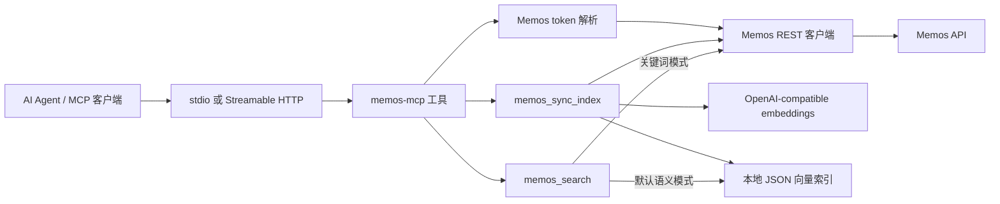

# memos-mcp

[English](./README.md) | **简体中文**

[](https://github.com/CharyeahOwO/memos-mcp/actions/workflows/ci.yml)
[](https://github.com/CharyeahOwO/memos-mcp/actions/workflows/docker-image.yml)

Memos-mcp 为 Memos 增加全文搜索、向量索引、语义检索和 MCP 工具调用能力，让你的 Memos 变成 AI Agent 可读取的长期记忆库。

memos-mcp 是一个轻量级的 Memos 语义检索层。它会把 Memos 内容同步到本地向量索引，提供关键词搜索和语义搜索，并通过 MCP 暴露给 AI Agent 使用，让你的个人记录可以被安全、可控地检索和调用。

## 能力

| 能力 | 说明 |
| --- | --- |
| 本地向量索引 | 将 memo embedding 存在 `MEMOS_MCP_INDEX_DB` 指向的本地 JSON 索引。 |
| 语义搜索 | `memos_search` 默认基于本地向量索引做语义检索。 |
| 关键词搜索 | `memos_search` 传 `mode: "keyword"` 时使用 Memos 关键词过滤。 |
| 时间检索 | 支持单日、日期范围、那年今日。 |
| 标签和资源 | 从 memo 分页结果中聚合标签和附件资源。 |
| 安全写入 | `memos_create` 必须显式传 `PRIVATE`、`PROTECTED` 或 `PUBLIC`。 |
| 更新控制 | `memos_update` 和 `memos_archive` 需要显式开启才会注册。 |
| MCP 传输 | 支持 stdio 和 Streamable HTTP。 |

支持的客户端包括 Claude Desktop、Cursor、VS Code Copilot MCP、Codex CLI、Hermes Agent、OpenClaw，以及支持 stdio 或 Streamable HTTP 的 MCP 客户端。

## 前置条件

| 项目 | 说明 |
| --- | --- |
| Node.js | 20 或更新 |
| Memos | 建议 v0.24+ |
| Memos PAT | stdio 使用 `MEMOS_ACCESS_TOKEN`，HTTP 使用 `Authorization: Bearer <Memos token>` |
| Embedding API | OpenAI-compatible `/v1/embeddings` endpoint |

embedding endpoint 是必需配置。`memos_search` 默认语义搜索；服务端会按 TTL 维护本地索引，`memos_sync_index` 仍可用于手动刷新或重建。

## 架构



运行模型只有一个：本地 MCP 服务加本地向量索引。stdio 和 HTTP 只是 MCP 客户端连接同一个服务的传输方式。

## 部署

### 1. 安装

```bash
git clone https://github.com/CharyeahOwO/memos-mcp.git
cd memos-mcp
npm install
cp .env.example .env
npm run build
```

### 2. 配置

最小 `.env`：

```env
MEMOS_BASE_URL=https://memos.example.com
MEMOS_ACCESS_TOKEN=memos_pat_xxxx
MEMOS_MCP_TRANSPORT=stdio

MEMOS_MCP_INDEX_DB=./data/memos-mcp-index.json
MEMOS_MCP_EMBEDDING_PROVIDER=openai-compatible
MEMOS_MCP_EMBEDDING_BASE_URL=https://api.example.com/v1
MEMOS_MCP_EMBEDDING_MODEL=BAAI/bge-m3
MEMOS_MCP_EMBEDDING_API_KEY=sk_xxxx
MEMOS_MCP_EMBEDDING_BATCH_SIZE=32
MEMOS_MCP_INDEX_TTL_MINUTES=120
MEMOS_MCP_EXPIRED_INDEX_BEHAVIOR=sync
MEMOS_MCP_SYNC_INTERVAL_MINUTES=120
MEMOS_MCP_SYNC_ON_START=true
```

embedding base URL 需要支持 OpenAI-compatible embedding 请求。例如 `MEMOS_MCP_EMBEDDING_BASE_URL=https://api.example.com/v1` 时，memos-mcp 会调用 `https://api.example.com/v1/embeddings`。

### 3. 运行

MCP 客户端直接启动服务进程时使用 stdio：

```bash
node --env-file=.env dist/index.js
```

MCP 客户端连接本地 endpoint 时使用 Streamable HTTP：

```bash
MEMOS_MCP_TRANSPORT=http \
MEMOS_MCP_HOST=127.0.0.1 \
MEMOS_MCP_PORT=8080 \
node --env-file=.env dist/index.js
```

HTTP endpoint：

```text
http://127.0.0.1:8080/mcp
```

HTTP 客户端必须发送：

```http
Authorization: Bearer <Memos token>
```

### 4. 维护索引

服务端会把本地向量索引当作带 TTL 的缓存。默认行为：

- `memos_search` 在语义搜索前检查索引状态。
- 索引缺失或过期时，服务端先执行一次增量同步。
- 长期运行的服务如果配置了 `MEMOS_ACCESS_TOKEN`，还会每 120 分钟后台同步一次。

手动维护工具仍然保留：

```text
memos_sync_index
memos_index_status
memos_search {"query":"your query"}
```

关键词搜索仍可使用：

```json
{
  "query": "project note",
  "mode": "keyword"
}
```

## Docker Compose

```yaml
services:
  memos-mcp:
    image: ghcr.io/charyeahowo/memos-mcp:main
    restart: unless-stopped
    environment:
      MEMOS_BASE_URL: http://host.docker.internal:5230
      MEMOS_ACCESS_TOKEN: memos_pat_xxxx
      MEMOS_MCP_TRANSPORT: http
      MEMOS_MCP_HOST: 0.0.0.0
      MEMOS_MCP_PORT: 8080
      MEMOS_MCP_READONLY: "false"
      MEMOS_MCP_ENABLE_UPDATE_TOOLS: "false"
      MEMOS_MCP_INDEX_DB: /data/memos-mcp-index.json
      MEMOS_MCP_EMBEDDING_PROVIDER: openai-compatible
      MEMOS_MCP_EMBEDDING_BASE_URL: https://api.example.com/v1
      MEMOS_MCP_EMBEDDING_MODEL: BAAI/bge-m3
      MEMOS_MCP_EMBEDDING_API_KEY: sk_xxxx
      MEMOS_MCP_EMBEDDING_BATCH_SIZE: "32"
      MEMOS_MCP_INDEX_TTL_MINUTES: "120"
      MEMOS_MCP_EXPIRED_INDEX_BEHAVIOR: sync
      MEMOS_MCP_SYNC_INTERVAL_MINUTES: "120"
      MEMOS_MCP_SYNC_ON_START: "true"
    ports:
      - "127.0.0.1:8080:8080"
    volumes:
      - memos-mcp-data:/data
    extra_hosts:
      - "host.docker.internal:host-gateway"

volumes:
  memos-mcp-data:
```

镜像会将 `/data` 创建为 UID/GID `10001:10001`，新的 named volume 会被非 root 进程正常写入。如果你已经用旧镜像创建过 root-owned volume，需要重建该 volume 或修正所有权后再运行 `memos_sync_index`。

使用 `/data` bind mount 时，宿主机目录必须允许 UID/GID `10001:10001` 写入：

```bash
mkdir -p /tmp/memos-mcp-data
sudo chown -R 10001:10001 /tmp/memos-mcp-data
```

bind mount 形态：

```yaml
volumes:
  - /tmp/memos-mcp-data:/data
```

## systemd

创建 `/etc/memos-mcp/memos-mcp.env`：

```env
MEMOS_BASE_URL=http://127.0.0.1:5230
MEMOS_MCP_TRANSPORT=http
MEMOS_MCP_HOST=127.0.0.1
MEMOS_MCP_PORT=8080
MEMOS_MCP_INDEX_DB=/var/lib/memos-mcp/memos-mcp-index.json
MEMOS_MCP_EMBEDDING_PROVIDER=openai-compatible
MEMOS_MCP_EMBEDDING_BASE_URL=https://api.example.com/v1
MEMOS_MCP_EMBEDDING_MODEL=BAAI/bge-m3
MEMOS_MCP_EMBEDDING_API_KEY=sk_xxxx
```

创建 `/etc/systemd/system/memos-mcp.service`：

```ini
[Unit]
Description=memos-mcp
After=network-online.target

[Service]
Type=simple
WorkingDirectory=/opt/memos-mcp
EnvironmentFile=/etc/memos-mcp/memos-mcp.env
ExecStart=/usr/bin/node /opt/memos-mcp/dist/index.js
Restart=on-failure
RestartSec=5

[Install]
WantedBy=multi-user.target
```

启动：

```bash
sudo systemctl daemon-reload
sudo systemctl enable --now memos-mcp
journalctl -u memos-mcp -f
```

## pm2

```js
module.exports = {
  apps: [
    {
      name: "memos-mcp",
      script: "dist/index.js",
      env: {
        MEMOS_BASE_URL: "http://127.0.0.1:5230",
        MEMOS_MCP_TRANSPORT: "http",
        MEMOS_MCP_HOST: "127.0.0.1",
        MEMOS_MCP_PORT: "8080",
        MEMOS_MCP_INDEX_DB: "./data/memos-mcp-index.json",
        MEMOS_MCP_EMBEDDING_PROVIDER: "openai-compatible",
        MEMOS_MCP_EMBEDDING_BASE_URL: "https://api.example.com/v1",
        MEMOS_MCP_EMBEDDING_MODEL: "BAAI/bge-m3",
        MEMOS_MCP_EMBEDDING_API_KEY: "sk_xxxx"
      }
    }
  ]
};
```

```bash
pm2 start ecosystem.config.cjs
pm2 save
```

## 客户端配置

### Claude Desktop / Cursor

```json
{
  "mcpServers": {
    "memos": {
      "command": "node",
      "args": ["/absolute/path/to/memos-mcp/dist/index.js"],
      "env": {
        "MEMOS_BASE_URL": "https://memos.example.com",
        "MEMOS_ACCESS_TOKEN": "memos_pat_xxxx",
        "MEMOS_MCP_INDEX_DB": "./data/memos-mcp-index.json",
        "MEMOS_MCP_EMBEDDING_PROVIDER": "openai-compatible",
        "MEMOS_MCP_EMBEDDING_BASE_URL": "https://api.example.com/v1",
        "MEMOS_MCP_EMBEDDING_MODEL": "BAAI/bge-m3",
        "MEMOS_MCP_EMBEDDING_API_KEY": "sk_xxxx"
      }
    }
  }
}
```

### VS Code Copilot MCP

```json
{
  "servers": {
    "memos": {
      "type": "stdio",
      "command": "node",
      "args": ["/absolute/path/to/memos-mcp/dist/index.js"],
      "env": {
        "MEMOS_BASE_URL": "https://memos.example.com",
        "MEMOS_ACCESS_TOKEN": "memos_pat_xxxx",
        "MEMOS_MCP_INDEX_DB": "./data/memos-mcp-index.json",
        "MEMOS_MCP_EMBEDDING_PROVIDER": "openai-compatible",
        "MEMOS_MCP_EMBEDDING_BASE_URL": "https://api.example.com/v1",
        "MEMOS_MCP_EMBEDDING_MODEL": "BAAI/bge-m3",
        "MEMOS_MCP_EMBEDDING_API_KEY": "sk_xxxx"
      }
    }
  }
}
```

### Codex CLI

```toml
[mcp_servers.memos]
command = "node"
args = ["/absolute/path/to/memos-mcp/dist/index.js"]

[mcp_servers.memos.env]
MEMOS_BASE_URL = "https://memos.example.com"
MEMOS_ACCESS_TOKEN = "memos_pat_xxxx"
MEMOS_MCP_INDEX_DB = "./data/memos-mcp-index.json"
MEMOS_MCP_EMBEDDING_PROVIDER = "openai-compatible"
MEMOS_MCP_EMBEDDING_BASE_URL = "https://api.example.com/v1"
MEMOS_MCP_EMBEDDING_MODEL = "BAAI/bge-m3"
MEMOS_MCP_EMBEDDING_API_KEY = "sk_xxxx"
```

### 通用 Streamable HTTP

```json
{
  "mcpServers": {
    "memos": {
      "type": "streamable-http",
      "url": "http://127.0.0.1:8080/mcp",
      "headers": {
        "Authorization": "Bearer memos_pat_xxxx"
      }
    }
  }
}
```

### Hermes Agent

```yaml
mcp_servers:
  memos:
    url: "http://127.0.0.1:8080/mcp"
    headers:
      Authorization: "Bearer memos_pat_xxxx"
    connect_timeout: 10
    timeout: 60
    enabled: true
```

### OpenClaw

```yaml
mcp:
  servers:
    memos:
      url: "http://127.0.0.1:8080/mcp"
      transport: "streamable-http"
      connectionTimeoutMs: 10000
      headers:
        Authorization: "Bearer memos_pat_xxxx"
```

CLI 形态：

```bash
openclaw mcp set memos '{"url":"http://127.0.0.1:8080/mcp","transport":"streamable-http","headers":{"Authorization":"Bearer memos_pat_xxxx"}}'
```

## 工具

| 工具 | 类型 | 说明 |
| --- | --- | --- |
| `memos_list` | 读 | 列出最近 memo。 |
| `memos_get` | 读 | 按 id 或 `memos/{id}` 获取 memo。 |
| `memos_search` | 读 | 默认语义搜索，传 `mode: "keyword"` 时关键词搜索。 |
| `memos_get_day` | 读 | 查询某个日历日的 memo。 |
| `memos_get_range` | 读 | 查询日期范围内的 memo。 |
| `memos_on_this_day` | 读 | 查询历史同月同日 memo。 |
| `memos_get_by_tag` | 读 | 按标签查询 memo。 |
| `tags_list` | 读 | 从 memo 分页结果聚合标签。 |
| `resources_list` | 读 | 从 memo 分页结果聚合附件资源。 |
| `memos_create` | 写 | 创建 memo，需要显式 visibility。 |
| `memos_update` | 写 | 需要 `MEMOS_MCP_ENABLE_UPDATE_TOOLS=true`。 |
| `memos_archive` | 写 | 需要 `MEMOS_MCP_ENABLE_UPDATE_TOOLS=true`。 |
| `memos_sync_index` | 读 | 将 Memos 内容同步到本地向量索引。 |
| `memos_index_status` | 读 | 查看索引状态、数量、维度、模型和路径。 |

## 配置

| 变量 | 默认值 | 是否必填 | 说明 |
| --- | --- | --- | --- |
| `MEMOS_BASE_URL` | 无 | 是 | Memos 实例地址。 |
| `MEMOS_ACCESS_TOKEN` | 无 | stdio / 定时同步 | stdio 模式和服务端启动/定时同步使用的 Memos PAT；HTTP 客户端仍可按请求传 token。 |
| `MEMOS_MCP_TRANSPORT` | `stdio` | 否 | `stdio` 或 `http`。 |
| `MEMOS_MCP_HOST` | `127.0.0.1` | 否 | HTTP 绑定地址。 |
| `MEMOS_MCP_PORT` | `8080` | 否 | HTTP 端口。 |
| `MEMOS_MCP_READONLY` | `false` | 否 | 隐藏所有写工具。 |
| `MEMOS_MCP_ENABLE_UPDATE_TOOLS` | `false` | 否 | 注册 `memos_update` 和 `memos_archive`。 |
| `MEMOS_MCP_TIMEZONE` | `UTC` | 否 | 日期工具使用的 IANA 时区。 |
| `MEMOS_MCP_INDEX_DB` | `./data/memos-mcp-index.json` | 否 | 本地 JSON 向量索引路径。 |
| `MEMOS_MCP_EMBEDDING_PROVIDER` | `openai-compatible` | 否 | embedding provider。 |
| `MEMOS_MCP_EMBEDDING_BASE_URL` | 无 | 是 | OpenAI-compatible base URL，通常以 `/v1` 结尾。 |
| `MEMOS_MCP_EMBEDDING_MODEL` | 无 | 是 | embedding 模型。 |
| `MEMOS_MCP_EMBEDDING_API_KEY` | 无 | 否 | embedding API key。 |
| `MEMOS_MCP_EMBEDDING_BATCH_SIZE` | `32` | 否 | embedding batch size，范围 1 到 128。 |
| `MEMOS_MCP_INDEX_TTL_MINUTES` | `120` | 否 | 本地向量索引有效期；`0` 表示永不过期。 |
| `MEMOS_MCP_EXPIRED_INDEX_BEHAVIOR` | `sync` | 否 | 索引过期时 `memos_search` 的行为：`sync`、`error` 或 `allow`。 |
| `MEMOS_MCP_SYNC_INTERVAL_MINUTES` | `120` | 否 | 后台定时同步间隔；`0` 关闭。需要 `MEMOS_ACCESS_TOKEN`。 |
| `MEMOS_MCP_SYNC_ON_START` | `true` | 否 | 服务启动后后台同步一次。需要 `MEMOS_ACCESS_TOKEN`。 |

## 排错

| 现象 | 检查项 |
| --- | --- |
| 启动时报 embedding 配置错误 | 设置 `MEMOS_MCP_EMBEDDING_BASE_URL` 和 `MEMOS_MCP_EMBEDDING_MODEL`。 |
| HTTP 客户端鉴权失败 | 每次 MCP 请求都发送 `Authorization: Bearer <Memos token>`。 |
| `memos_search` 提示索引为空 | 检查 embedding 配置和鉴权；默认会在搜索前自动同步。 |
| 语义搜索结果过旧 | 检查 `MEMOS_MCP_INDEX_TTL_MINUTES` 和 `MEMOS_MCP_EXPIRED_INDEX_BEHAVIOR`，或手动运行 `memos_sync_index`。 |
| Docker 同步索引时报 `EACCES` | 使用 named volume，或让 bind mount 目录可被 UID/GID `10001:10001` 写入。 |
| 日期工具结果不符合预期 | 设置 `MEMOS_MCP_TIMEZONE`，例如 `Asia/Shanghai`。 |

## 开发

```bash
npm install
npm run typecheck
npm test
npm run build
npm run validate:repo
npm run smoke:http
```

真实 Memos API 测试：

```bash
MEMOS_BASE_URL=https://memos.example.com \
MEMOS_ACCESS_TOKEN=memos_pat_xxxx \
npm run smoke:memos
```

## 更多文档

- [Architecture](./docs/architecture.md)
- [Deployment](./docs/deployment.md)
- [Development](./docs/development.md)
- [Semantic Search](./docs/semantic-search.md)

## 许可证

[MIT](./LICENSE) © CharyeahOwO


## 友情链接

<a href="https://linux.do" target="_blank">
  
</a>
