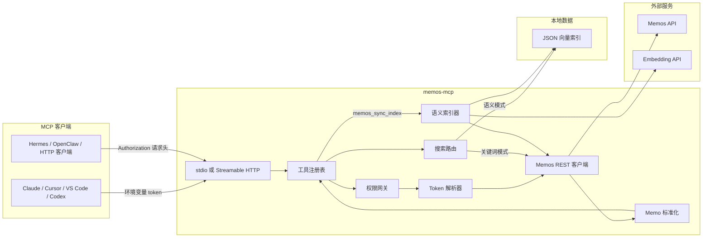

# memos-mcp

[English](./README.md) | **简体中文**

[](https://github.com/CharyeahOwO/memos-mcp/actions/workflows/ci.yml)
[](https://github.com/CharyeahOwO/memos-mcp/actions/workflows/docker-image.yml)

面向 [Memos](https://github.com/usememos/memos) 的 MCP 服务器。AI 客户端可以通过 Model Context Protocol 读取、搜索和写入你的 Memos 实例。

适合这些场景：

- 让 AI 按关键词、日期、标签或语义相似度搜索 memo。
- 读取最近 memo，或按 id 获取指定 memo。
- 创建 memo，并显式选择 `PRIVATE`、`PROTECTED` 或 `PUBLIC`。
- 在开启写工具后更新或归档 memo。

## 范围

| 能力 | 状态 |
| --- | --- |
| 列表、详情、关键词搜索 | 支持 |
| 日期范围、单日、那年今日 | 支持 |
| 标签和资源聚合 | 支持 |
| 创建 memo | 支持，必须显式传 visibility |
| 更新和归档 memo | 支持，需开启 |
| 语义搜索 | 支持，需开启本地向量索引 |
| 删除 memo | 未实现 |
| Memos 管理员 / 用户管理 | 未实现 |
| 资源上传 | 未实现 |

## 前置条件

| 项目 | 版本 / 说明 |
| --- | --- |
| Node.js | 20 或更新 |
| Memos | 建议 v0.24+ |
| Memos token | Personal Access Token，示例里写作 `memos_pat_xxxxxxxx` |
| Embedding API | 只有语义搜索需要，必须兼容 OpenAI embeddings API |

## 选择接入方式

| 方式 | 适合 | 传输 | 本地数据 |
| --- | --- | --- | --- |
| 客户端启动 stdio | Claude Desktop、Cursor、VS Code、Codex | `stdio` | 无 |
| 本地 HTTP 服务 | Hermes、OpenClaw、自定义 MCP 客户端 | Streamable HTTP | 无 |
| 语义搜索形态 | 需要更好的历史 memo 召回 | `stdio` 或 HTTP | JSON 向量索引 |

已给出配置示例：

| 客户端 / 运行方式 | 是否包含示例 |
| --- | --- |
| Claude Desktop | 是 |
| Cursor | 是 |
| VS Code Copilot MCP | 是 |
| Codex CLI | 是 |
| Hermes Agent | 是 |
| OpenClaw | 是 |
| 通用 Streamable HTTP | 是 |
| systemd / pm2 | 服务部署 |
| Docker Compose | 服务部署 |

## 架构



关键行为：

| 部分 | 行为 |
| --- | --- |
| `stdio` 鉴权 | token 来自 `MEMOS_ACCESS_TOKEN`。 |
| HTTP 鉴权 | token 来自每次请求的 `Authorization: Bearer ...` 请求头。 |
| 权限网关 | 只读模式会把写工具从 `tools/list` 隐藏。 |
| 语义索引 | `memos_sync_index` 读取 memo、调用 embedding、写入 `MEMOS_MCP_INDEX_DB`。 |
| 搜索路由 | 只有开启语义搜索后，`memos_search` 默认才走语义模式。 |

## 安装

```bash
git clone https://github.com/CharyeahOwO/memos-mcp.git
cd memos-mcp
npm install
cp .env.example .env
npm run build
```

stdio 最小 `.env`：

```env
MEMOS_BASE_URL=https://memos.example.com
MEMOS_ACCESS_TOKEN=memos_pat_xxxxxxxx
MEMOS_MCP_TRANSPORT=stdio
```

构建验证：

```bash
npm run verify
```

## 部署

### 客户端启动 stdio

适合由 MCP 客户端直接启动服务进程。

```bash
MEMOS_BASE_URL=https://memos.example.com \
MEMOS_ACCESS_TOKEN=memos_pat_xxxxxxxx \
MEMOS_MCP_TRANSPORT=stdio \
node dist/index.js
```

客户端配置里应使用 `dist/index.js` 的绝对路径。

### 本地 HTTP 服务

适合需要 HTTP endpoint 的 MCP 客户端。

```bash
MEMOS_BASE_URL=https://memos.example.com \
MEMOS_MCP_TRANSPORT=http \
MEMOS_MCP_HOST=127.0.0.1 \
MEMOS_MCP_PORT=8080 \
node dist/index.js
```

Endpoint：

```text
http://127.0.0.1:8080/mcp
```

健康检查：

```text
http://127.0.0.1:8080/healthz
```

HTTP 客户端必须发送 Memos token：

```http
Authorization: Bearer memos_pat_xxxxxxxx
```

### 语义搜索形态

在 stdio 或 HTTP 部署上增加这些变量：

```env
MEMOS_MCP_ENABLE_SEMANTIC_SEARCH=true
MEMOS_MCP_INDEX_DB=./data/memos-mcp-index.json
MEMOS_MCP_EMBEDDING_PROVIDER=openai-compatible
MEMOS_MCP_EMBEDDING_BASE_URL=https://api.example.com/v1
MEMOS_MCP_EMBEDDING_MODEL=BAAI/bge-m3
MEMOS_MCP_EMBEDDING_API_KEY=sk_xxxxxxxx
MEMOS_MCP_EMBEDDING_BATCH_SIZE=32
```

然后从 MCP 客户端调用：

```text
memos_sync_index
memos_index_status
memos_search {"query":"your query"}
```

说明：

- `memos_sync_index` 会把 memo 文本发送给配置的 embedding API。
- 不同 Memos 账号或不同 embedding model 不应共用同一个索引文件。
- `memos_search` 传 `mode: "keyword"` 可以强制走关键词搜索。

### Docker Compose

```yaml
services:
  memos-mcp:
    image: ghcr.io/charyeahowo/memos-mcp:main
    restart: unless-stopped
    environment:
      MEMOS_BASE_URL: http://host.docker.internal:5230
      MEMOS_MCP_TRANSPORT: http
      MEMOS_MCP_HOST: 0.0.0.0
      MEMOS_MCP_PORT: 8080
      MEMOS_MCP_READONLY: "false"
      MEMOS_MCP_ENABLE_UPDATE_TOOLS: "false"
      MEMOS_MCP_ENABLE_SEMANTIC_SEARCH: "false"
      MEMOS_MCP_INDEX_DB: /data/memos-mcp-index.json
    ports:
      - "127.0.0.1:8080:8080"
    volumes:
      - memos-mcp-data:/data
    extra_hosts:
      - "host.docker.internal:host-gateway"

volumes:
  memos-mcp-data:
```

如果在 Docker 中开启语义搜索，把语义搜索形态里的 embedding 变量加到 `environment`。

### systemd

创建 `/etc/memos-mcp/memos-mcp.env`：

```env
MEMOS_BASE_URL=http://127.0.0.1:5230
MEMOS_MCP_TRANSPORT=http
MEMOS_MCP_HOST=127.0.0.1
MEMOS_MCP_PORT=8080
MEMOS_MCP_READONLY=false
MEMOS_MCP_ENABLE_UPDATE_TOOLS=false
```

创建 `/etc/systemd/system/memos-mcp.service`：

```ini
[Unit]
Description=memos-mcp
After=network-online.target

[Service]
Type=simple
WorkingDirectory=/opt/memos-mcp
EnvironmentFile=/etc/memos-mcp/memos-mcp.env
ExecStart=/usr/bin/node /opt/memos-mcp/dist/index.js
Restart=on-failure
RestartSec=5

[Install]
WantedBy=multi-user.target
```

启动：

```bash
sudo systemctl daemon-reload
sudo systemctl enable --now memos-mcp
journalctl -u memos-mcp -f
```

### pm2

```js
module.exports = {
  apps: [
    {
      name: "memos-mcp",
      script: "dist/index.js",
      env: {
        MEMOS_BASE_URL: "http://127.0.0.1:5230",
        MEMOS_MCP_TRANSPORT: "http",
        MEMOS_MCP_HOST: "127.0.0.1",
        MEMOS_MCP_PORT: "8080"
      }
    }
  ]
};
```

```bash
pm2 start ecosystem.config.cjs
pm2 save
```

### 反向代理

如果代理 HTTP 模式，必须保留 `Authorization` 请求头。

```nginx
location /mcp {
  proxy_pass http://127.0.0.1:8080/mcp;
  proxy_set_header Authorization $http_authorization;
  proxy_set_header Host $host;
}

location /healthz {
  proxy_pass http://127.0.0.1:8080/healthz;
}
```

## 客户端配置

把 `/absolute/path/to/memos-mcp` 换成你的本地路径。

### Claude Desktop / Cursor

```json
{
  "mcpServers": {
    "memos": {
      "command": "node",
      "args": ["/absolute/path/to/memos-mcp/dist/index.js"],
      "env": {
        "MEMOS_BASE_URL": "https://memos.example.com",
        "MEMOS_ACCESS_TOKEN": "memos_pat_xxxxxxxx"
      }
    }
  }
}
```

### VS Code Copilot MCP

```json
{
  "servers": {
    "memos": {
      "type": "stdio",
      "command": "node",
      "args": ["/absolute/path/to/memos-mcp/dist/index.js"],
      "env": {
        "MEMOS_BASE_URL": "https://memos.example.com",
        "MEMOS_ACCESS_TOKEN": "memos_pat_xxxxxxxx"
      }
    }
  }
}
```

### Codex CLI

```toml
[mcp_servers.memos]
command = "node"
args = ["/absolute/path/to/memos-mcp/dist/index.js"]

[mcp_servers.memos.env]
MEMOS_BASE_URL = "https://memos.example.com"
MEMOS_ACCESS_TOKEN = "memos_pat_xxxxxxxx"
```

### 通用 Streamable HTTP

```json
{
  "mcpServers": {
    "memos": {
      "type": "streamable-http",
      "url": "http://127.0.0.1:8080/mcp",
      "headers": {
        "Authorization": "Bearer memos_pat_xxxxxxxx"
      }
    }
  }
}
```

### Hermes Agent

```yaml
mcp_servers:
  memos:
    url: "http://127.0.0.1:8080/mcp"
    headers:
      Authorization: "Bearer memos_pat_xxxxxxxx"
    connect_timeout: 10
    timeout: 60
    enabled: true
```

### OpenClaw

```yaml
mcp:
  servers:
    memos:
      url: "http://127.0.0.1:8080/mcp"
      transport: "streamable-http"
      connectionTimeoutMs: 10000
      headers:
        Authorization: "Bearer memos_pat_xxxxxxxx"
```

CLI 形式：

```bash
openclaw mcp set memos '{"url":"http://127.0.0.1:8080/mcp","transport":"streamable-http","headers":{"Authorization":"Bearer memos_pat_xxxxxxxx"}}'
```

## 工具

| 工具 | 类型 | 可用条件 |
| --- | --- | --- |
| `memos_list` | 读 | 默认 |
| `memos_get` | 读 | 默认 |
| `memos_search` | 读 | 默认关键词，开启语义后默认语义 |
| `memos_get_day` | 读 | 默认 |
| `memos_get_range` | 读 | 默认 |
| `memos_on_this_day` | 读 | 默认 |
| `memos_get_by_tag` | 读 | 默认 |
| `tags_list` | 读 | 默认 |
| `resources_list` | 读 | 默认 |
| `memos_create` | 写 | `MEMOS_MCP_READONLY=true` 时隐藏 |
| `memos_update` | 写 | 需要 `MEMOS_MCP_ENABLE_UPDATE_TOOLS=true` |
| `memos_archive` | 写 | 需要 `MEMOS_MCP_ENABLE_UPDATE_TOOLS=true` |
| `memos_sync_index` | 读 | 需要 `MEMOS_MCP_ENABLE_SEMANTIC_SEARCH=true` |
| `memos_index_status` | 读 | 需要 `MEMOS_MCP_ENABLE_SEMANTIC_SEARCH=true` |

## 配置

| 变量 | 默认值 | 是否必填 | 说明 |
| --- | --- | --- | --- |
| `MEMOS_BASE_URL` | 无 | 是 | Memos 实例地址 |
| `MEMOS_ACCESS_TOKEN` | 无 | 仅 stdio 必填 | stdio 模式使用的 Memos PAT |
| `MEMOS_MCP_TRANSPORT` | `stdio` | 否 | `stdio` 或 `http` |
| `MEMOS_MCP_HOST` | `127.0.0.1` | 否 | HTTP 绑定地址 |
| `MEMOS_MCP_PORT` | `8080` | 否 | HTTP 端口 |
| `MEMOS_MCP_READONLY` | `false` | 否 | 隐藏写工具 |
| `MEMOS_MCP_ENABLE_UPDATE_TOOLS` | `false` | 否 | 启用 update/archive |
| `MEMOS_MCP_TIMEZONE` | `UTC` | 否 | 日期工具使用的 IANA 时区 |
| `MEMOS_MCP_ENABLE_SEMANTIC_SEARCH` | `false` | 否 | 启用语义工具，并让搜索默认语义 |
| `MEMOS_MCP_INDEX_DB` | `./data/memos-mcp-index.json` | 仅语义搜索 | 本地 JSON 向量索引路径 |
| `MEMOS_MCP_EMBEDDING_PROVIDER` | `disabled` | 仅语义搜索 | `disabled` 或 `openai-compatible` |
| `MEMOS_MCP_EMBEDDING_BASE_URL` | 无 | 仅语义搜索 | OpenAI-compatible base URL |
| `MEMOS_MCP_EMBEDDING_MODEL` | 无 | 仅语义搜索 | embedding 模型 |
| `MEMOS_MCP_EMBEDDING_API_KEY` | 无 | 否 | embedding API key |
| `MEMOS_MCP_EMBEDDING_BATCH_SIZE` | `32` | 否 | 1-128 |

## 验证

```bash
npm run verify
npm run smoke:http
```

真实 Memos API 读测试：

```bash
MEMOS_BASE_URL=https://memos.example.com \
MEMOS_ACCESS_TOKEN=memos_pat_xxxxxxxx \
npm run smoke:memos
```

真实 Memos API 写测试：

```bash
MEMOS_BASE_URL=https://memos.example.com \
MEMOS_ACCESS_TOKEN=memos_pat_xxxxxxxx \
MEMOS_MCP_SMOKE_WRITE=true \
npm run smoke:memos
```

## 排错

| 现象 | 检查项 |
| --- | --- |
| 客户端无法启动 stdio server | 使用 `dist/index.js` 绝对路径，并先运行 `npm run build`。 |
| HTTP 客户端鉴权失败 | 每次 MCP 请求都发送 `Authorization: Bearer memos_pat_xxxxxxxx`。 |
| `memos_search` 提示索引为空 | 先调用 `memos_sync_index`。 |
| 语义搜索结果太旧 | memo 变更后重新调用 `memos_sync_index`。 |
| 日期工具结果不符合预期 | 设置 `MEMOS_MCP_TIMEZONE`，例如 `Asia/Shanghai`。 |
| 写工具看不到 | 检查 `MEMOS_MCP_READONLY` 和 `MEMOS_MCP_ENABLE_UPDATE_TOOLS`。 |

## 开发

```bash
npm install
npm run typecheck
npm test
npm run build
npm run validate:repo
npm run smoke:http
```

## 更多文档

- [Architecture](./docs/architecture.md)
- [Deployment](./docs/deployment.md)
- [Development](./docs/development.md)
- [Semantic Search](./docs/semantic-search.md)

## 许可证

[MIT](./LICENSE) © CharyeahOwO
