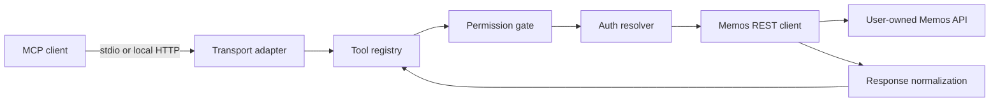
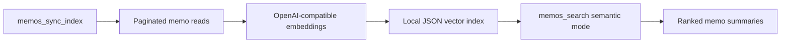

# Architecture

memos-mcp is a local-first MCP server for a user's own Memos instance.

## Boundaries

- Base profile keeps no local memo copy.
- Semantic profile stores vectors at `MEMOS_MCP_INDEX_DB`.
- Write tools are hidden when `MEMOS_MCP_READONLY=true`.
- Update/archive tools require `MEMOS_MCP_ENABLE_UPDATE_TOOLS=true`.
- Delete tools are intentionally not implemented.
- Semantic/vector dependencies are opt-in.

## Profiles

| Profile | Storage | Search |
| --- | --- | --- |
| Base local retrieval | none | Memos native keyword/filter API |
| Local retrieval + semantic search | local JSON index at `MEMOS_MCP_INDEX_DB` | semantic by default in `memos_search` |

SQLite/FTS and in-process local embedding models are planned upgrades, not base requirements.

## Layers



Optional semantic profile:



## Tool Registration

All tools are declared as factories in `src/tools/*` and registered in `src/server/register-tools.ts`.

Rules:

- `isWrite=true` tools are hidden when `MEMOS_MCP_READONLY=true`.
- `memos_update` and `memos_archive` require `MEMOS_MCP_ENABLE_UPDATE_TOOLS=true`.
- `memos_sync_index` and `memos_index_status` require `MEMOS_MCP_ENABLE_SEMANTIC_SEARCH=true`.
- Delete tools are intentionally not implemented.

## Auth Model

stdio:

- Token comes from `MEMOS_ACCESS_TOKEN`.

local HTTP:

- Token can come from `Authorization: Bearer <token>` on each request.

## Memos Compatibility

The Memos API has changed field names and filter syntax across versions. The project isolates drift in:

- `src/memos/client.ts`
- `src/memos/normalize.ts`
- `src/memos/types.ts`

Internal tools consume `NormalizedMemo`, not raw upstream responses.

Current keyword search uses:

```text
content.contains("query")
```

Time, tag, and resource tools aggregate over paginated memo reads to avoid relying on unstable server-side filter syntax.

## Safety Defaults

- `memos_create` requires explicit `visibility`.
- HTTP binds to `127.0.0.1` by default.
- Tokens and memo content are not logged.
- Runtime data lives under ignored local paths such as `data/`.
- External embedding providers are explicit opt-in; memo content may be sent to that provider during indexing.

## Repository Shape

```text
src/
  auth/
  config/
  indexer/
  logging/
  memos/
  server/
  tools/
tests/
docs/
scripts/
Dockerfile
docker-compose.example.yml
README.md
```
