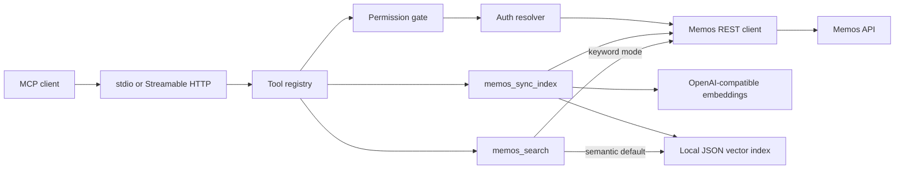

# Architecture

memos-mcp is a lightweight semantic retrieval layer for a user's Memos instance. It runs as an MCP server, reads memo data from Memos, writes embeddings to a local JSON vector index, and exposes search/read/write tools to MCP clients.

## Runtime Model



The vector index is part of the normal runtime. `memos_search` uses semantic retrieval by default, and keyword retrieval is an explicit search mode.

## Data Flow

1. `memos_sync_index` reads memo pages from Memos through the authenticated Memos API client.
2. Unchanged memo embeddings are reused from the existing local index.
3. New or changed memo content and tags are embedded through the configured OpenAI-compatible embedding endpoint.
4. Embeddings are L2-normalized and written to `MEMOS_MCP_INDEX_DB`.
5. `memos_search` checks index TTL before semantic search and runs incremental sync first when the configured expired-index behavior is `sync`.
6. `memos_search` embeds and normalizes the query, ranks local memo vectors by dot product, and returns memo summaries.
7. `memos_search` with `mode: "keyword"` bypasses the index and uses Memos keyword filtering.

## Tool Registration

All tools are declared as factories in `src/tools/*` and registered in `src/server/register-tools.ts`.

Tool selection depends on the metadata returned by MCP `tools/list`:

- `name`: stable programmatic identifier, for example `memos_search`.
- `title`: short display name.
- `description`: when to use the tool and when not to use it.
- `inputSchema`: required parameters, allowed enum values, limits, and parameter descriptions.
- `annotations`: behavior hints such as `readOnlyHint`, `destructiveHint`, `idempotentHint`, and `openWorldHint`.

Rules:

- `isWrite=true` tools are hidden when `MEMOS_MCP_READONLY=true`.
- `memos_update` and `memos_archive` require `MEMOS_MCP_ENABLE_UPDATE_TOOLS=true`.
- `memos_sync_index` and `memos_index_status` are always registered because the vector index is required.
- Delete tools are not implemented.

## Auth Model

stdio:

- Token comes from `MEMOS_ACCESS_TOKEN`.

Streamable HTTP:

- Token comes from each request's `Authorization: Bearer <Memos token>` header.

## Memos Compatibility

The Memos API has changed field names and filter syntax across versions. Compatibility handling is isolated in:

- `src/memos/client.ts`
- `src/memos/normalize.ts`
- `src/memos/types.ts`

Internal tools consume `NormalizedMemo`, not raw upstream responses.

Current keyword search uses:

```text
content.contains("query")
```

Time, tag, and resource tools aggregate over paginated memo reads to avoid relying on unstable server-side filter syntax.

## Safety Defaults

- `memos_create` requires explicit `visibility`.
- HTTP binds to `127.0.0.1` by default.
- Tokens and memo content are not logged.
- Runtime index data lives under ignored local paths such as `data/`.
- The configured embedding provider receives memo content during indexing and query text during semantic search.

## Repository Shape

```text
src/
  auth/
  config/
  indexer/
  logging/
  memos/
  server/
  tools/
tests/
docs/
scripts/
Dockerfile
docker-compose.example.yml
README.md
```
